# Graded Lab Activity #1 – Provisioning and Managing an Azure Virtual Machine

| | |
|---|---|
| **Name** | Hye Ran Yoo |
| **Student number** | 041145212 |
| **Course** | CST8912 – Cloud Solution Architecture |
| **Section** | 013 |
| **Date** | September 19, 2026 |
| **Lab title** | Graded Lab Activity #1 – Provisioning and Managing an Azure Virtual Machine |

## 1. Configuration summary

| Item | Value |
|---|---|
| Subscription type | Azure for Students |
| Resource group | `CST8912-Lab1-041145212` |
| VM name | `cst8912-vm-hry` |
| Region | Canada Central |
| Image | Ubuntu Server 24.04 LTS – x64 Gen2 |
| Size | Standard_B2ats_v2 (2 vCPUs, 1 GiB memory) – approved variation, see section 2 |
| OS disk type | Premium SSD LRS (30 GiB, image default) |
| Log Analytics workspace | `cst8912-law-hry` (Canada Central, Pay-as-you-go) |
| Other names | SSH key: `cst8912-key-hry` · Virtual network: `vnet-canadacentral-1` (name proposed by the portal) · Data collection rule: `msvmi-canadacentral-cst8912-vm-hry` |

## 2. Approved variations

| Item | Lab instruction | What I used | Reason |
|---|---|---|---|
| VM size | Standard_B1s | Standard_B2ats_v2 | Standard_B1s is not available in my subscription. Portal message: *"This size is currently unavailable in CanadaCentral for this subscription: NotAvailableForSubscription."* My subscription policy allows five regions (canadacentral, northcentralus, mexicocentral, westus3, westus2). I checked all five and B1s was blocked in every region. Standard_B2ats_v2 is the smallest burstable, general-purpose size I could use in Canada Central. The lab instructor approved this size verbally during the lab session on September 18, 2026. |
| Region | Canada Central | Canada Central | No change. |
| OS disk | Premium SSD LRS | Premium SSD LRS | No change. |
| Names | Suggested names | Suggested names | No change. For the virtual network I used the name proposed by the portal, which Task 4 allows. |

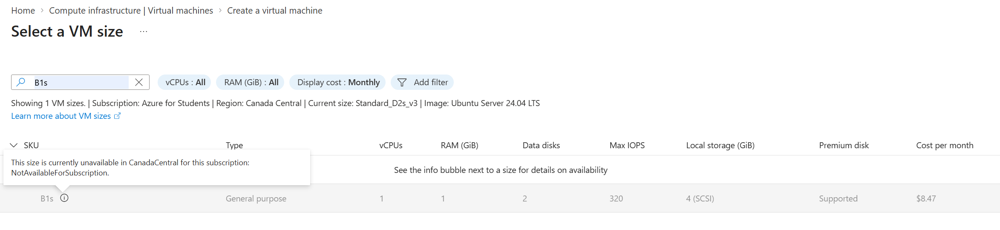

*Figure 1. Portal message: Standard_B1s is not available for this subscription.*

**Note (Task 8).** The portal menu is now called "Insights (now Monitor)". The default option was "OpenTelemetry metrics", which does not use a Log Analytics workspace, so I selected "Log-based metrics (classic)" with cst8912-law-hry.

## 3. Screenshots

Sensitive information (email address, subscription ID, workspace ID, private IP address) is hidden.

### 3.1 Resource group (Task 1)

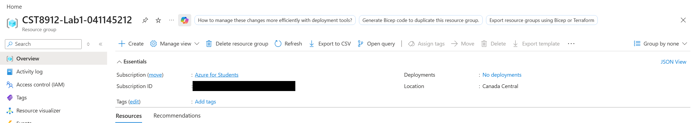

*Figure 2. Resource group CST8912-Lab1-041145212 in Canada Central.*

### 3.2 VM deployment and Overview page (Tasks 2–5)

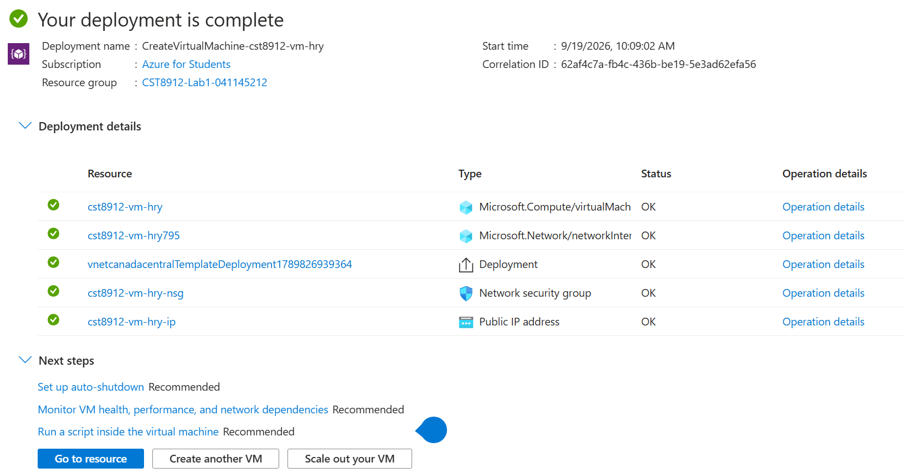

*Figure 3. VM deployment is complete. VM, NIC, NSG, public IP and virtual network were created.*

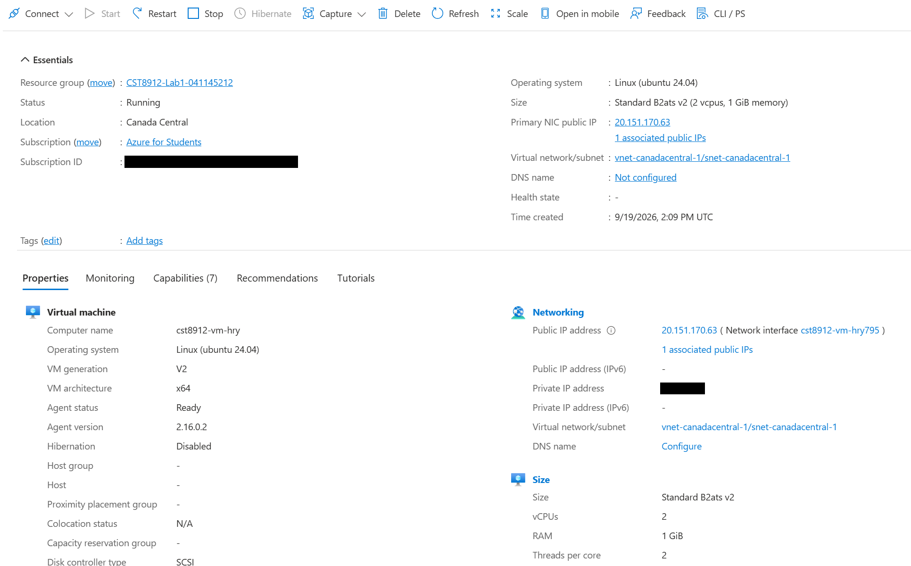

*Figure 4. VM Overview page. Status is Running.*

### 3.3 Stop, start and restart (Task 6)

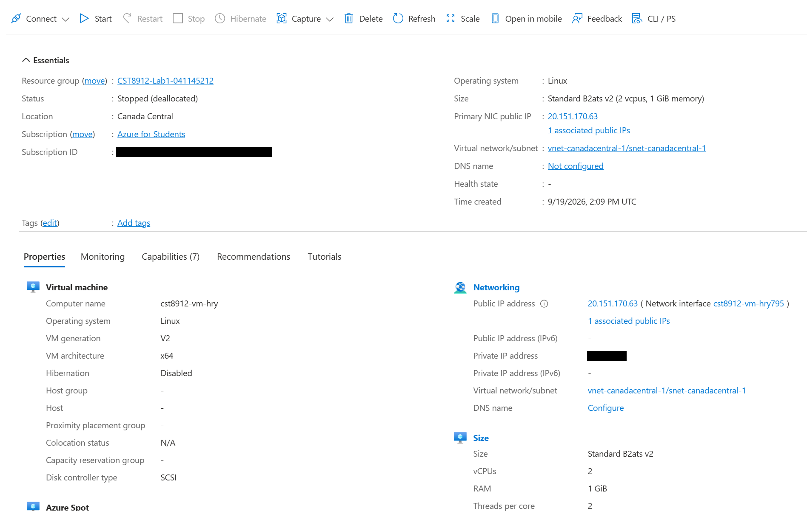

*Figure 5. After Stop. Status is Stopped (deallocated).*

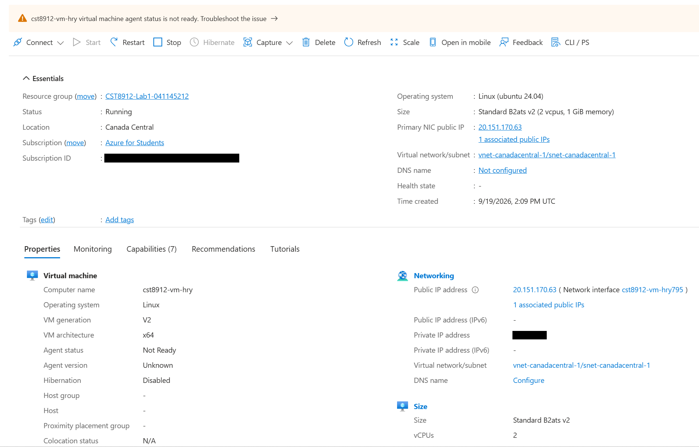

*Figure 6. After Start. Status is Running. The agent warning appeared only for a short time right after boot.*

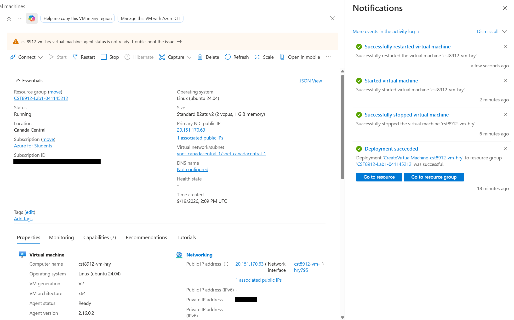

*Figure 7. After Restart. Status is Running and Agent status is Ready. The notifications show that stop, start and restart all succeeded. (The warning banner is left over from before the page refresh.)*

### 3.4 Log Analytics workspace (Task 7)

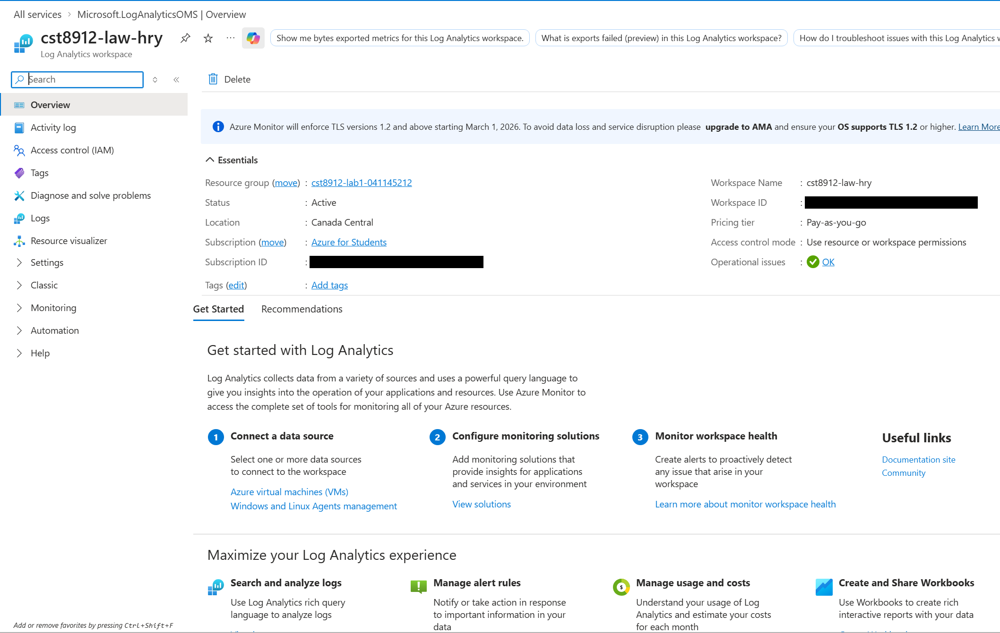

*Figure 8. Log Analytics workspace cst8912-law-hry (Canada Central, Pay-as-you-go).*

### 3.5 VM Insights (Task 8)

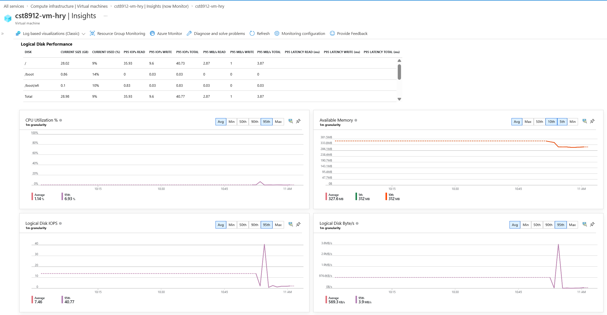

*Figure 9. VM Insights performance charts (log-based). Disk, CPU and memory data come from the guest OS.*

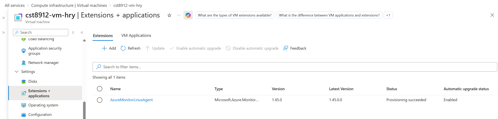

*Figure 10. VM extensions. Only the Azure Monitor Agent is installed. The Dependency Agent (Map) is not installed.*

### 3.6 SSH command output (Task 9)

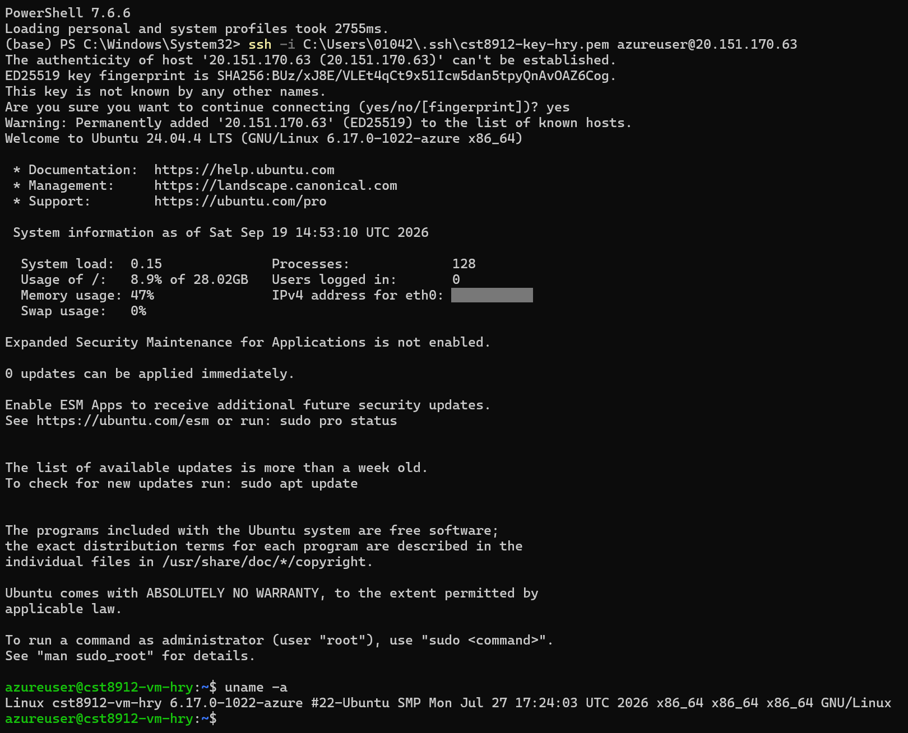

*Figure 11. SSH login as azureuser and the output of uname -a.*

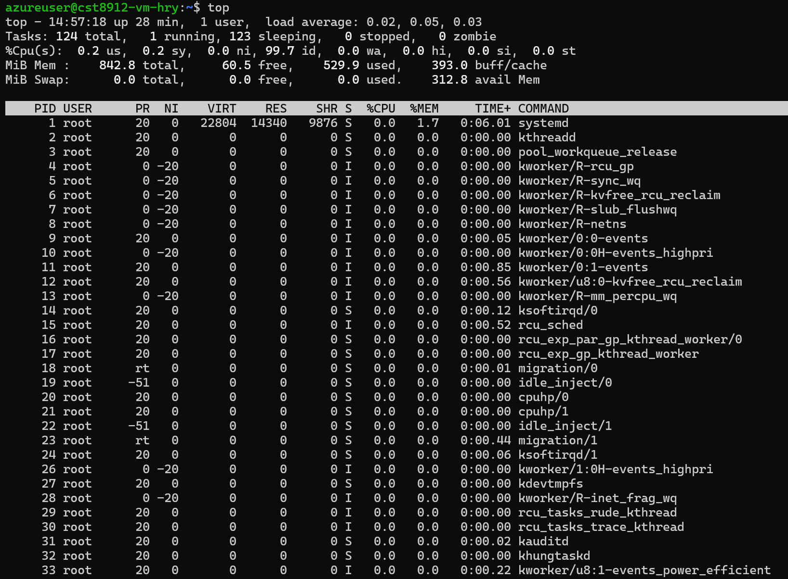

*Figure 12. Output of top.*

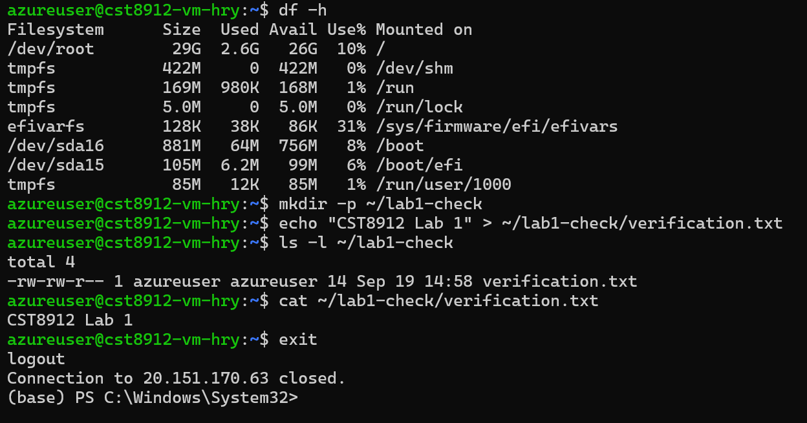

*Figure 13. Output of df -h, the verification file (CST8912 Lab 1), and exit.*

### 3.7 Cleanup confirmation (Task 10)

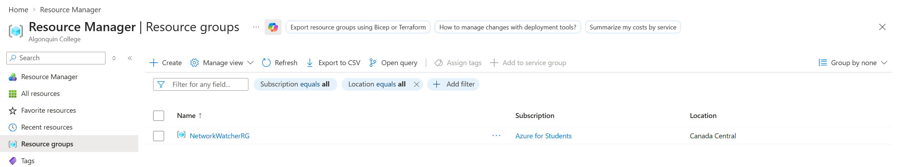

*Figure 14. Resource groups list after deletion. CST8912-Lab1-041145212 is gone. NetworkWatcherRG was created automatically by Azure, so I did not touch it.*

## 4. Architecture relationships

- **Virtual machine and OS disk.** The VM (cst8912-vm-hry) is the compute resource. It runs Ubuntu Server 24.04. The OS disk is a managed disk (Premium SSD LRS, 30 GiB) attached to the VM. It stores the operating system and my files.
- **Network interface, virtual network and subnet.** The VM has one network interface (NIC). The NIC connects the VM to the default subnet (snet-canadacentral-1) inside the virtual network (vnet-canadacentral-1). The NIC gets a private IP address from this subnet.
- **Public IP and network security group.** The public IP address is attached to the NIC, so I can reach the VM from the internet. The network security group (NSG) is also attached to the NIC and works like a firewall. It has one inbound rule that allows only TCP port 22 (SSH). My SSH connection goes: my laptop → public IP → NSG rule → NIC → VM.
- **Monitoring.** The Azure Monitor Agent is installed inside the VM as a VM extension. The data collection rule (DCR) tells the agent what data to collect and where to send it. The agent sends performance data to the Log Analytics workspace (cst8912-law-hry). VM Insights reads the data from the workspace and shows the charts.
- **IaaS responsibilities.** Azure manages the physical servers, storage, network and the hypervisor. I am responsible for the guest operating system, the software, the network access rules (NSG), the SSH key and the monitoring setup.

## 5. Reflection

- **Compute.** I used a very small VM (2 vCPUs, 1 GiB memory). The top command showed about 530 MiB used out of 843 MiB right after boot, so this size is enough for the lab but not for a real workload. When I stopped the VM from the portal, the status became "Stopped (deallocated)", which means the compute is released and not charged. After Start, the VM agent needed one or two minutes to become Ready.
- **Storage.** The OS disk is a separate resource from the VM. The df -h command showed a 29 GB root disk with 10% used, which matches the 30 GiB image default. The disk still exists and costs money when the VM is stopped.
- **Networking.** The portal created the virtual network, subnet, NIC, public IP and NSG together with the VM. Only port 22 was open. The public IP was static, so it stayed the same after stop and start.
- **Monitoring.** Azure can show CPU from outside the VM without an agent. But memory and free disk space are only known inside the guest OS, so the Azure Monitor Agent is needed. After I enabled VM Insights, the data took about 10 minutes to appear in the charts.
- **Cost control.** I used the smallest approved size and finished the lab in one session (about 70 minutes). I did not add anything extra. There was no data disk, no alerts, and no Map. The workspace is Pay-as-you-go, so it only costs money for the data it receives.
- **Cleanup.** Before deleting, I checked the resource list. All nine resources belonged to this lab. Deleting the resource group removed everything at once. In my past work with AWS, I created resources by hand in the console, and I had to find and delete each one. It took a lot of time. In Azure, every resource belongs to a resource group, so cleanup was much easier. This shows why a dedicated resource group is useful.
