# CST8912 – Cloud Solution Architecture: Graded Lab Activity 2 (Azure VNet peering and private connectivity)

| | |
|---|---|
| **Name** | Hye Ran Yoo |
| **Student number** | 041145212 |
| **Course** | CST8912 – Cloud Solution Architecture |
| **Section** | 013 |
| **Date** | September 26, 2026 |
| **Lab title** | Graded Lab Activity 2 (Azure VNet peering and private connectivity) |

## 1. The purpose of the lab and the two regions I selected

This lab introduces Azure VNet peering. Two VNets are placed in one region and one VNet in a different region, so the lab shows both same-region peering and global peering. After deploying one VM in each VNet, I used private IP addresses to test RDP connectivity over TCP port 3389 with `Test-NetConnection`.

| Lab label | Region I selected |
|---|---|
| Region A | Canada Central |
| Region B | North Central US |

## 2. Completed resource table: VNet address spaces, VM-to-VNet mappings, and private IP addresses

| Resource | Region | Address / network | Purpose |
|---|---|---|---|
| `CST8912-demo` | Canada Central | Resource group | Contains only this lab's resources |
| `cst8912-vnet0` | Canada Central | 10.0.0.0/16; default 10.0.0.0/24 | Global peering endpoint |
| `cst8912-vnet1` | North Central US | 10.1.0.0/16; default 10.1.0.0/24 | Same-region peering endpoint |
| `cst8912-vnet2` | North Central US | 10.2.0.0/16; default 10.2.0.0/24 | Same-region peering endpoint |
| `vm0` | Canada Central | cst8912-vnet0 / default | Public RDP entry point (public IP, RDP from my IP only) |
| `vm1` | North Central US | cst8912-vnet1 / default | Private test target / source (no public IP) |
| `vm2` | North Central US | cst8912-vnet2 / default | Private test target (no public IP) |

| VM | Expected subnet | Private IP address | Size | Image |
|---|---|---|---|---|
| vm0 | 10.0.0.0/24 | 10.0.0.4 | Standard_B2als_v2 | Windows Server 2022 Datacenter – x64 Gen2 |
| vm1 | 10.1.0.0/24 | 10.1.0.4 | Standard_B2als_v2 | Windows Server 2022 Datacenter – x64 Gen2 |
| vm2 | 10.2.0.0/24 | 10.2.0.4 | Standard_B2als_v2 | Windows Server 2022 Datacenter – x64 Gen2 |

Peering links (three pairs, six directional links):

| Pair | Type | Links |
|---|---|---|
| vnet0 ↔ vnet1 | Global peering (Canada Central ↔ North Central US) | `cst8912-vnet0-to-cst8912-vnet1`, `cst8912-vnet1-to-cst8912-vnet0` |
| vnet0 ↔ vnet2 | Global peering (Canada Central ↔ North Central US) | `cst8912-vnet0-to-cst8912-vnet2`, `cst8912-vnet2-to-cst8912-vnet0` |
| vnet1 ↔ vnet2 | Local peering (both in North Central US) | `cst8912-vnet1-to-cst8912-vnet2`, `cst8912-vnet2-to-cst8912-vnet1` |

## 3. The five screenshot checkpoints

**Privacy check:** account names, subscription IDs, public IP addresses and the VM user name are cropped or hidden. Private lab IP addresses remain because they are required evidence.

### Screenshot checkpoint 1 – Virtual networks list showing the three VNet names and regions

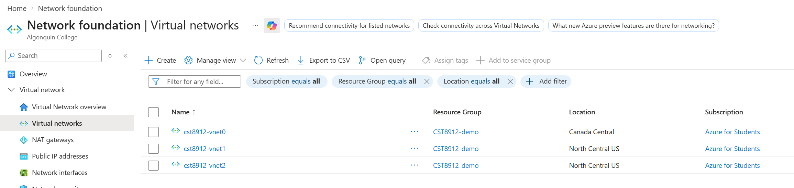

### Screenshot checkpoint 2 – Peerings list for each VNet, all six directional links Connected and Fully Synchronized

**cst8912-vnet0**

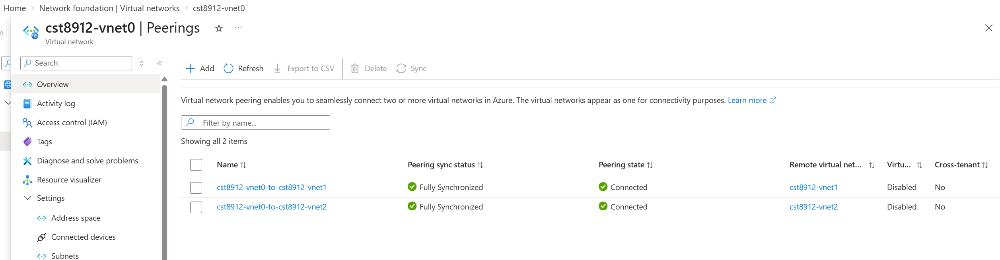

**cst8912-vnet1**

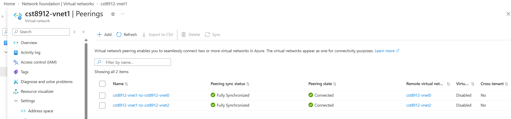

**cst8912-vnet2**

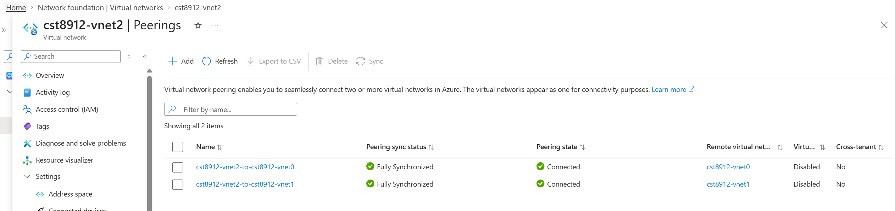

### Screenshot checkpoint 3 – Virtual machines list showing vm0, vm1, and vm2 in Running state

Only vm0 has a public IP address (hidden).

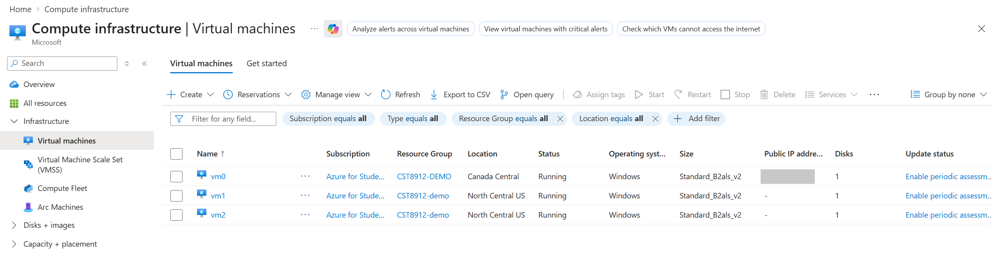

### Screenshot checkpoint 4 – The three PowerShell results: vm0→vm1, vm0→vm2, and vm1→vm2

**vm0 → vm1 (10.1.0.4), port 3389 – TcpTestSucceeded : True**

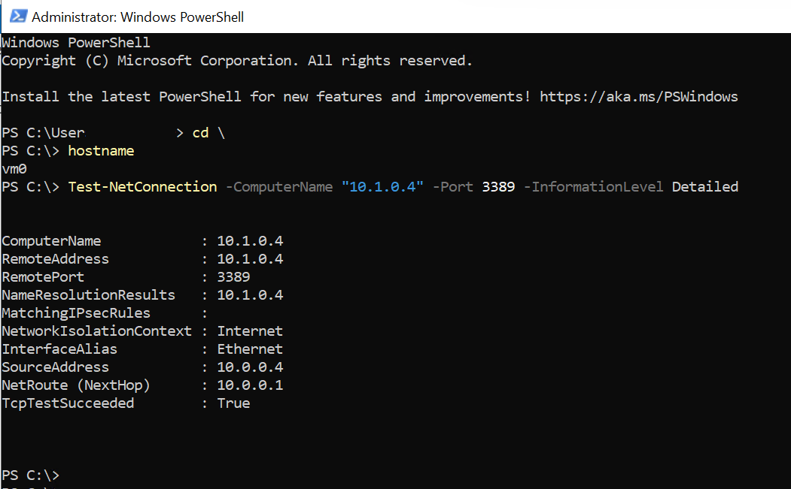

**vm0 → vm2 (10.2.0.4), port 3389 – TcpTestSucceeded : True**

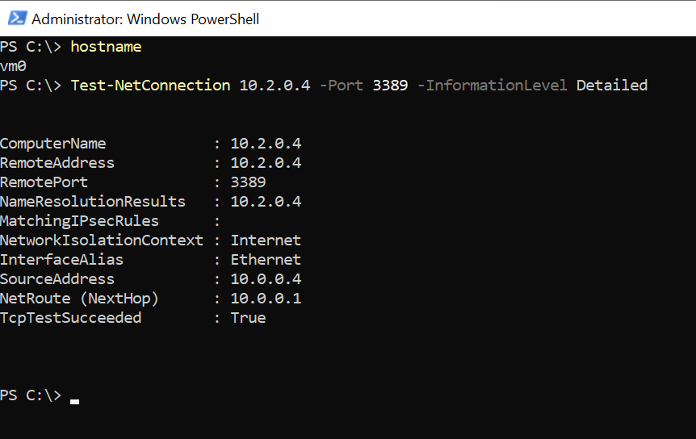

**vm1 → vm2 (10.2.0.4), port 3389 – TcpTestSucceeded : True** (I opened vm1 from vm0 with Remote Desktop and ran the test inside vm1.)

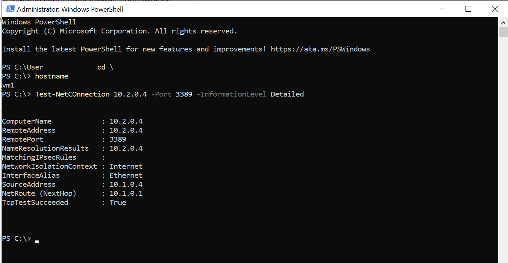

### Screenshot checkpoint 5 – Resource groups list after deletion, showing that CST8912-demo is not present

The notification shows "Deleted resource group CST8912-demo". NetworkWatcherRG was created automatically by Azure, so I did not touch it.

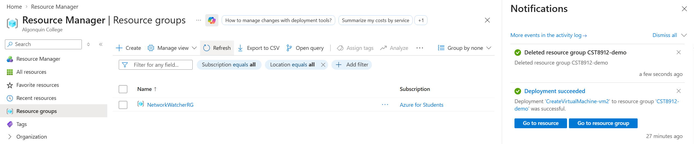

## 4. Local peering, global peering, and why the address spaces must not overlap

- A VNet is a private network in Azure, and one VNet belongs to one region. VNets are separated from each other by default, so a VM in one VNet cannot reach a VM in another VNet with a private IP address.
- **VNet peering** connects two VNets. After peering, resources in the two VNets can communicate with private IP addresses through the Microsoft backbone network, not the public internet.
- **Local peering** (virtual network peering) connects two VNets in the same region. In this lab, cst8912-vnet1 and cst8912-vnet2 are both in North Central US.
- **Global peering** (global virtual network peering) connects two VNets in different regions. In this lab, cst8912-vnet0 in Canada Central is peered with cst8912-vnet1 and cst8912-vnet2 in North Central US. The portal steps are the same for both types.
- Peering is not transitive. This means a peering does not pass traffic on to a third VNet: vnet1 cannot reach vnet2 through vnet0. This is why I created all three pairs directly.
- **Why the address spaces must not overlap:** Azure sends traffic to a peered VNet by its address range. If two peered VNets had the same range, for example 10.1.0.4 in both, Azure could not know which VNet the address belongs to. For this reason Azure does not allow a peering between VNets with overlapping address spaces. In this lab, the three VNets use 10.0.0.0/16, 10.1.0.0/16 and 10.2.0.0/16.

## 5. Interpretation of each Test-NetConnection result and troubleshooting performed

| Test | Source | Destination | Port | Result | Peering used |
|---|---|---|---|---|---|
| 1 | vm0 (10.0.0.4) | vm1 (10.1.0.4) | 3389 | TcpTestSucceeded : True | vnet0 ↔ vnet1 (global) |
| 2 | vm0 (10.0.0.4) | vm2 (10.2.0.4) | 3389 | TcpTestSucceeded : True | vnet0 ↔ vnet2 (global) |
| 3 | vm1 (10.1.0.4) | vm2 (10.2.0.4) | 3389 | TcpTestSucceeded : True | vnet1 ↔ vnet2 (local) |

- **Interpretation:** each **True** result means that the source VM could reach TCP port 3389 on the destination VM through VNet peering and the network security rules. It does not test application performance or other ports.
- Test 1 and test 2 prove the two global peerings. Test 3 proves the local peering.
- vm1 and vm2 have no public IP address and no extra NSG rules. The default rule `AllowVnetInBound` allows the traffic from the peered VNets, so the tests passed without any change to their NSGs.
- **Troubleshooting performed:** none. All three tests passed on the first try, so I did not use Network Watcher.
- Before this lab, I knew peering only from the slides. In this lab I connected VNets in two regions with peering and tested the connection from inside the VMs. Now I understand how peering works and how a network is built in the cloud. This was a useful lab for me.

## 6. Approved substitutions (region, VM size, Ubuntu fallback) and the exact reason

### Region

- Region A: Canada Central, Region B: North Central US. Both are in my subscription's Allowed locations policy, and Standard_B2als_v2 is available in both.

### VM size

- Standard_B2s → **Standard_B2als_v2** (2 vCPUs, 4 GiB memory) for all three VMs.
- Standard_B2s is not available in my subscription. Portal message: *"This size is currently unavailable in CanadaCentral for this subscription: NotAvailableForSubscription."* Azure CLI showed the same result in both regions.
- Standard_B2als_v2 meets the minimum (2 vCPUs, 4 GiB), is the lowest-cost size I can use, and is the equivalent listed in the lab document. The lab instructor also said in the lab session on September 18, 2026 that we can use a size that is available in our region.

**Portal message – Standard_B2s is not available for this subscription**

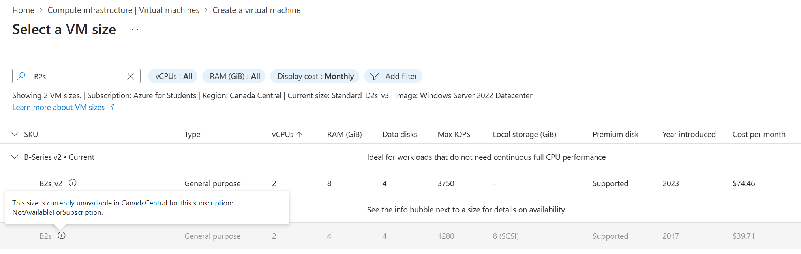

**Azure CLI check in Cloud Shell – size availability and vCPU quota in both regions**

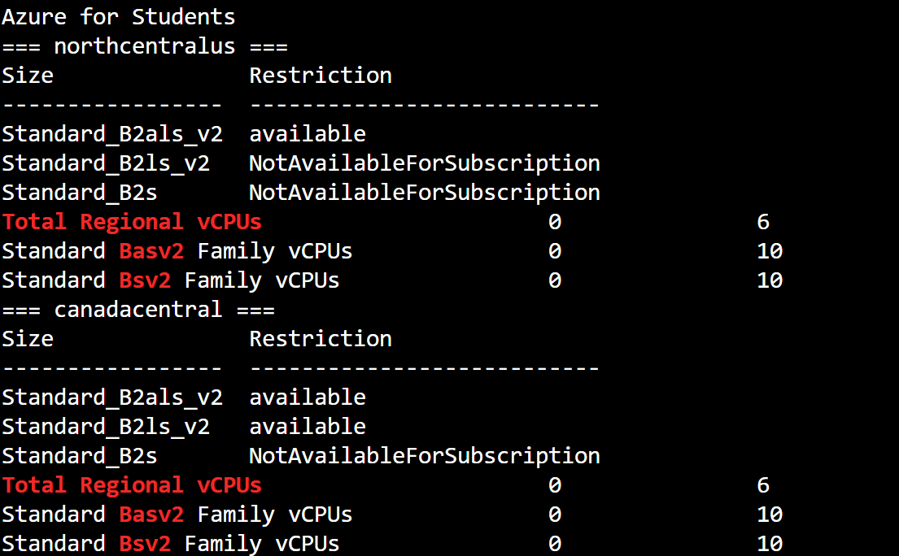

### Ubuntu fallback

- Windows Server 2022 Datacenter – x64 Gen2 (no change, Ubuntu fallback not needed)

## 7. Cleanup evidence showing that the CST8912-demo resource group no longer exists

The screenshot in checkpoint 5 shows the Resource groups list after I deleted `CST8912-demo`. The group had 16 resources: 3 VNets, 3 VMs, 3 network interfaces, 3 network security groups, 3 OS disks and 1 public IP address. I checked the list before deleting and all of them were created for this lab.

Azure deleted all 16 resources with one action, but it still took more than 5 minutes. If I had to find and delete each resource by hand, it would take much longer and I could make mistakes. Deleting by resource group is a very useful feature.
